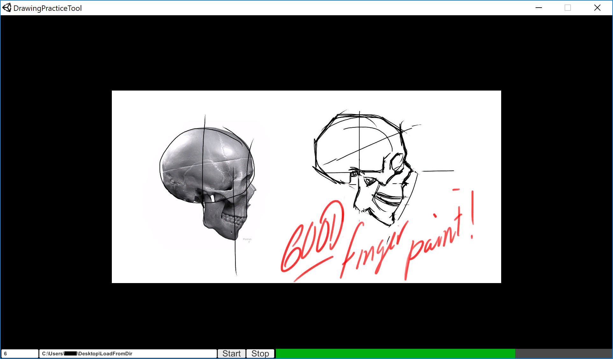

# DrawingPracticeTool

Online gesture drawing practice tools give little control, especially over which images you are going to use. This Unity application lets you use whatever images you want. If you want to practice portraits, weapons, animals, etc, just use those images. Images will be automatically scaled to fit within the application window so don't worry about them being oversized.

NOTE: Only tested on Windows

1) Download and unzip the latest release
2) Create a folder and dump the images you want to use into it
3) Launch the program (choose a 16x9 resolution like 1920x1080)
4) Enter number of seconds per image into the input field labeled "Seconds". This will be saved to a file and reloaded so you don't have to do it every time you launch. Remaining time is represented by the green bar at the bottom.
5) Copy and paste the location of your folder (something like "C:\Users\Your_User_Name\Desktop\Your_Directory_Name") full of images into the input field labeled "Image Directory". This will be saved to a file and reloaded so you don't have to do it every time you launch.
6) Press Start
7) Draw :)

